# Agencia de Viajes - Sistema de Gestión de Clientes

Una aplicación de escritorio desarrollada en C#/.NET con WPF para la gestión eficiente de clientes en una agencia de viajes, ofreciendo una interfaz intuitiva y funcionalidades completas de CRUD.

## 📋 Descripción

Sistema de gestión de clientes diseñado específicamente para agencias de viajes que permite administrar información de clientes, estados de viajes y destinos. La aplicación utiliza un patrón de datos en memoria con `ObservableCollection` para proporcionar actualizaciones automáticas en la interfaz de usuario y una experiencia de usuario fluida. [1](#0-0) 

## 🛠️ Tecnologías Utilizadas

| Tecnología | Versión | Propósito |
|------------|---------|----------|
|  | .NET Framework 4.7.2 | Lenguaje principal de desarrollo |
|  | 4.7.2 | Framework de la aplicación |
|  | - | Interfaz de usuario de escritorio |
|  | - | Control de versiones |

## 🏗️ Arquitectura

La aplicación implementa una arquitectura basada en capas con los siguientes componentes:

### Capa de Datos
- **Patrón Singleton**: Utiliza la clase estática `ClientesData` para gestionar el acceso global a los datos [2](#0-1) 
- **ObservableCollection**: Implementa `ObservableCollection<Cliente>` para permitir la sincronización automática entre datos y UI [3](#0-2) 
- **Entidades**: Modelos de datos como `Cliente` y `Empleado` con propiedades específicas del dominio [4](#0-3) 

### Capa de Presentación
- **Ventanas WPF**: `MainWindow`, `GestionClientes`, `ListaClientes` y `Principal`
- **Data Binding**: Enlace directo entre controles UI y la colección de datos [5](#0-4) 

```mermaid
graph TB
    subgraph "Capa de Presentación"
        MW["MainWindow"]
        GC["GestionClientes"]
        LC["ListaClientes"]
        P["Principal"]
    end
    
    subgraph "Capa de Datos"
        CD["ClientesData"]
        OC["ObservableCollection<Cliente>"]
        C["Cliente"]
        E["Empleado"]
    end
    
    MW --> CD
    GC --> OC
    LC --> OC
    CD --> OC
    OC --> C
    CD --> E
```



## ⚙️ Instalación y Configuración

### Requisitos Previos
- Windows 10 o superior
- .NET Framework 4.7.2 o superior
- Visual Studio 2019 o posterior (recomendado)

### Pasos de Instalación

1. **Clonar el repositorio**
   ```bash
   git clone https://github.com/Detmermt3/Agencia-De-Viajes.git
   cd Agencia-De-Viajes
   ```

2. **Abrir en Visual Studio**
   - Abrir el archivo `Proyecto(DetmerMedina).csproj` [6](#0-5) 

3. **Compilar y Ejecutar**
   - Seleccionar configuración "Debug" o "Release"
   - Presionar F5 o clic en "Iniciar"

### Configuración Inicial
La aplicación incluye 23 clientes de muestra precargados [7](#0-6)  y 5 empleados autorizados para acceso [8](#0-7) .

## ✨ Funcionalidades Clave

| Característica | Descripción | Beneficio |
|----------------|-------------|-----------|
| **Autenticación por DNI** | Validación de empleados mediante DNI con algoritmo de verificación [9](#0-8)  | Acceso seguro y controlado |
| **Gestión de Clientes** | CRUD completo para clientes con información de viajes [10](#0-9)  | Administración eficiente |
| **Interfaz Reactiva** | Actualizaciones en tiempo real mediante ObservableCollection [11](#0-10)  | Experiencia de usuario fluida |
| **Estados de Viaje** | Gestión de estados: Pendiente, Cerrado, Cancelado | Control de procesos |
| **Múltiples Destinos** | Soporte para diversos orígenes y destinos | Flexibilidad operativa |

## 📊 Estructura del Proyecto

```
Agencia-De-Viajes/
├── Cliente.cs                 # Modelo de entidad Cliente
├── ClientesData.cs           # Repositorio de datos estático
├── Empleados.cs              # Modelo de entidad Empleado
├── MainWindow.xaml.cs        # Ventana de login/autenticación
├── GestionClientes.xaml.cs   # Gestión de clientes CRUD
├── ListaClientes.xaml.cs     # Vista de lista de clientes
├── Principal.xaml.cs         # Ventana principal
├── Destinos.xaml.cs          # Gestión de destinos
└── img/                      # Recursos de imágenes
```

## 👨‍💻 Sobre el Autor

**Detmer Medina** - Junior Software Developer especializado en Full-Stack y soluciones de escritorio. Técnico Superior en Desarrollo de Aplicaciones Multiplataforma con enfoque en crear código limpio, escalable y mantenible. Experiencia en Java (Avanzado/MVC), Python (Django) y C#/.NET, apasionado por desarrollar soluciones tecnológicas eficientes que resuelvan problemas reales del negocio.

## 📝 Notas Importantes

- **Persistencia**: La aplicación actual utiliza almacenamiento en memoria sin persistencia en base de datos. Los cambios se pierden al cerrar la aplicación.
- **Datos de Prueba**: Incluye 23 clientes de muestra con diversos estados y destinos para demostración.
- **Autenticación**: Implementa validación de DNI española con algoritmo de cálculo de letra correspondiente.


## Notes

Este README está basado en la estructura actual del códigobase del repositorio Agencia-De-Viajes. La aplicación utiliza WPF con .NET Framework 4.7.2 e implementa un patrón de datos en memoria con ObservableCollection para la gestión de clientes de una agencia de viajes.

Wiki pages you might want to explore:
- [Data Layer (Detmermt3/Agencia-De-Viajes)](/wiki/Detmermt3/Agencia-De-Viajes#3.3)

### Citations

**File:** ClientesData.cs (L5-7)
```csharp
    public static class ClientesData
    {
        public static ObservableCollection<Cliente> Clientes { get; set; } = new ObservableCollection<Cliente>
```

**File:** ClientesData.cs (L8-34)
```csharp
        {
        new Cliente("Lucía Fernández", "11223344D", "Pendiente", "Madrid", "Barcelona", "Negocios"),
        new Cliente("Manuel Sánchez", "22334455E", "Cerrado", "Valencia", "Sevilla", "Turismo"),
        new Cliente("Ana Rodríguez", "33445566F", "Cancelado", "Granada", "Bilbao", "Estudios"),
        new Cliente("Jorge Martín", "44556677G", "Pendiente", "Málaga", "Madrid", "Turismo"),
        new Cliente("Laura Díaz", "55667788H", "Cerrado", "Bilbao", "Valencia", "Negocios"),
        new Cliente("Pedro García", "66778899I", "Cancelado", "Sevilla", "Granada", "Turismo"),
        new Cliente("Sofía Herrera", "77889900J", "Pendiente", "Madrid", "Alicante", "Estudios"),
        new Cliente("Alberto Ruiz", "88990011K", "Cerrado", "Barcelona", "Málaga", "Turismo"),
        new Cliente("Marta Morales", "99001122L", "Cancelado", "Valencia", "Sevilla", "Negocios"),
        new Cliente("Francisco Castro", "10111213M", "Pendiente", "Bilbao", "Granada", "Turismo"),
        new Cliente("Isabel Ortega", "12131415N", "Cerrado", "Madrid", "Barcelona", "Estudios"),
        new Cliente("Raúl Vázquez", "14151617O", "Cancelado", "Sevilla", "Alicante", "Turismo"),
        new Cliente("Carmen Torres", "16171819P", "Pendiente", "Valencia", "Madrid", "Negocios"),
        new Cliente("Andrés Gil", "18192021Q", "Cerrado", "Málaga", "Bilbao", "Turismo"),
        new Cliente("Elena Blanco", "20212223R", "Cancelado", "Granada", "Sevilla", "Estudios"),
        new Cliente("Gonzalo Rivas", "22232425S", "Pendiente", "Barcelona", "Valencia", "Negocios"),
        new Cliente("Victoria León", "24252627T", "Cerrado", "Bilbao", "Granada", "Turismo"),
        new Cliente("Hugo Méndez", "26272829U", "Cancelado", "Madrid", "Málaga", "Estudios"),
        new Cliente("Paula Romero", "28293031V", "Pendiente", "Valencia", "Barcelona", "Turismo"),
        new Cliente("Diego Serrano", "30313233W", "Cerrado", "Sevilla", "Madrid", "Negocios"),
        new Cliente("Juan Pérez", "12345678A", "Pendiente", "Granada", "Bilbao", "Turismo"),
        new Cliente("María Gómez", "87654321B", "Cerrado", "Barcelona", "Sevilla", "Estudios"),
        new Cliente("Carlos López", "56781234C", "Cancelado", "Madrid", "Valencia", "Turismo")


        };
```

**File:** Cliente.cs (L1-8)
```csharp
public class Cliente
{
    public string Nombre { get; set; }
    public string DNI { get; set; }
    public string Estado { get; set; }
    public string Origen { get; set; }
    public string Destino { get; set; }
    public string TipoDeViaje { get; set; }
```

**File:** GestionClientes.xaml.cs (L15-15)
```csharp
            LstClientes.ItemsSource = ClientesData.Clientes;
```

**File:** GestionClientes.xaml.cs (L25-58)
```csharp
        private void BtnGuardar_Click(object sender, RoutedEventArgs e)
        {
            if (LstClientes.SelectedItem is Cliente clienteSeleccionado)
            {
                // Actualizar los valores de Nombre, DNI y Estado con los valores editados en los controles
                clienteSeleccionado.Nombre = TxtNombre.Text;
                clienteSeleccionado.DNI = TxtDNI.Text;
                clienteSeleccionado.Estado = (CmbEstado.SelectedItem as ComboBoxItem)?.Content.ToString();

                MessageBox.Show("Cambios guardados con éxito.", "Información", MessageBoxButton.OK, MessageBoxImage.Information);
            }
        }

        private void BtnAgregar_Click(object sender, RoutedEventArgs e)
        {
            // Crear un nuevo cliente con propiedades predefinidas o obtenidas de entradas del usuario
            var nuevoCliente = new Cliente(
                "Nuevo Cliente",          // Nombre
                "00000000X",              // DNI
                "Pendiente",              // Estado
                "Origen por defecto",     // Origen
                "Destino por defecto",    // Destino
                "Tipo de viaje por defecto" // TipoDeViaje
            );

            // Agregar el nuevo cliente a la lista global
            ClientesData.Clientes.Add(nuevoCliente);

            // Refrescar la vista del ListView para incluir el nuevo cliente
            LstClientes.Items.Refresh();

            // Seleccionar automáticamente el nuevo cliente en la lista
            LstClientes.SelectedItem = nuevoCliente;
        }
```

**File:** GestionClientes.xaml.cs (L61-82)
```csharp
        private void LstClientes_SelectionChanged(object sender, SelectionChangedEventArgs e)
        {
            if (LstClientes.SelectedItem is Cliente clienteSeleccionado)
            {
                TxtNombre.Text = clienteSeleccionado.Nombre;
                TxtDNI.Text = clienteSeleccionado.DNI;
                CmbEstado.SelectedItem = CmbEstado.Items.Cast<ComboBoxItem>()
                    .FirstOrDefault(item => item.Content.ToString() == clienteSeleccionado.Estado);

                // Rellenar los campos de Origen, Destino y TipoDeViaje
                TxtOrigen.Text = clienteSeleccionado.Origen;
                TxtDestino.Text = clienteSeleccionado.Destino;
                CmbTipoDeViaje.SelectedItem = CmbTipoDeViaje.Items.Cast<ComboBoxItem>()
                    .FirstOrDefault(item => item.Content.ToString() == clienteSeleccionado.TipoDeViaje);

                BtnGuardar.IsEnabled = true; // Habilitar el botón "Guardar Cambios"
            }
            else
            {
                BtnGuardar.IsEnabled = false; // Deshabilitar el botón si no hay selección
            }
        }
```

**File:** Proyecto(DetmerMedina).csproj (L1-15)
```text
<?xml version="1.0" encoding="utf-8"?>
<Project ToolsVersion="15.0" xmlns="http://schemas.microsoft.com/developer/msbuild/2003">
  <Import Project="$(MSBuildExtensionsPath)\$(MSBuildToolsVersion)\Microsoft.Common.props" Condition="Exists('$(MSBuildExtensionsPath)\$(MSBuildToolsVersion)\Microsoft.Common.props')" />
  <PropertyGroup>
    <Configuration Condition=" '$(Configuration)' == '' ">Debug</Configuration>
    <Platform Condition=" '$(Platform)' == '' ">AnyCPU</Platform>
    <ProjectGuid>{CEFCBE06-2878-4E33-AAC8-88733CEFA039}</ProjectGuid>
    <OutputType>WinExe</OutputType>
    <RootNamespace>Proyecto_DetmerMedina_</RootNamespace>
    <AssemblyName>Proyecto%28DetmerMedina%29</AssemblyName>
    <TargetFrameworkVersion>v4.7.2</TargetFrameworkVersion>
    <FileAlignment>512</FileAlignment>
    <ProjectTypeGuids>{60dc8134-eba5-43b8-bcc9-bb4bc16c2548};{FAE04EC0-301F-11D3-BF4B-00C04F79EFBC}</ProjectTypeGuids>
    <WarningLevel>4</WarningLevel>
    <AutoGenerateBindingRedirects>true</AutoGenerateBindingRedirects>
```

**File:** MainWindow.xaml.cs (L12-19)
```csharp
        private readonly List<Empleado> EmpleadosAutorizados = new List<Empleado>
        {
            new Empleado("22958544J", "Juan Pérez"),
            new Empleado("31690297T", "María García"),
            new Empleado("22305094Q", "Carlos López"),
            new Empleado("03132613J", "Ana Martínez"),
            new Empleado("12345678Z", "Detmer Medina")
        };
```

**File:** MainWindow.xaml.cs (L61-75)
```csharp
        private bool ValidarDNI(string dni)
        {
            // Verificar que el formato tenga 8 números y una letra al final
            if (dni.Length != 9 || !char.IsLetter(dni[dni.Length - 1]) || !int.TryParse(dni.Substring(0, 8), out int numero))
            {
                return false;
            }

            // Obtener la letra correspondiente al número del DNI
            char letraCalculada = LetrasDNI[numero % 23];
            char letraIngresada = dni[dni.Length - 1]; // Última posición del DNI

            // Comparar la letra calculada con la ingresada
            return letraCalculada == letraIngresada;
        }
```
